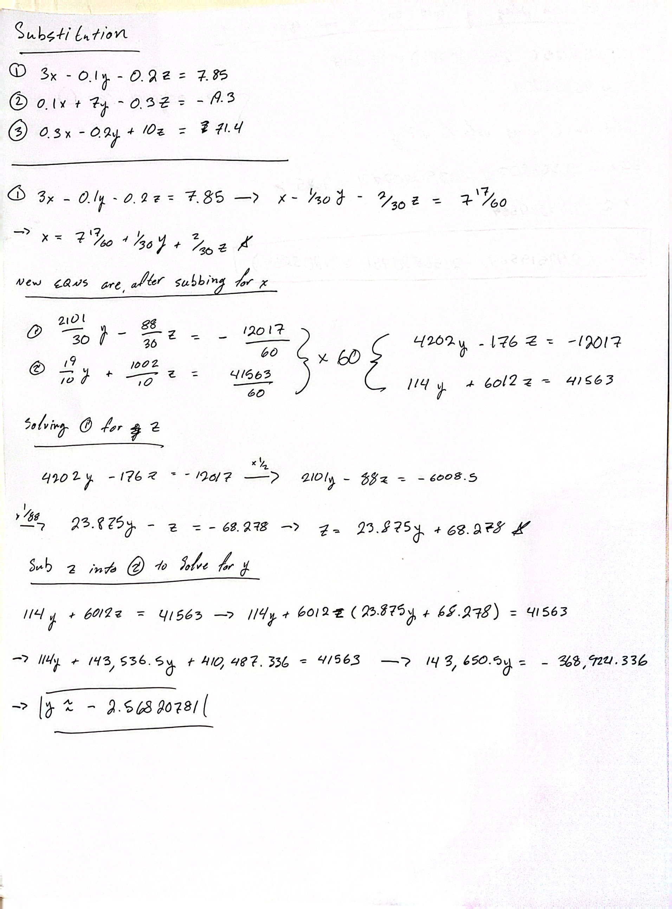
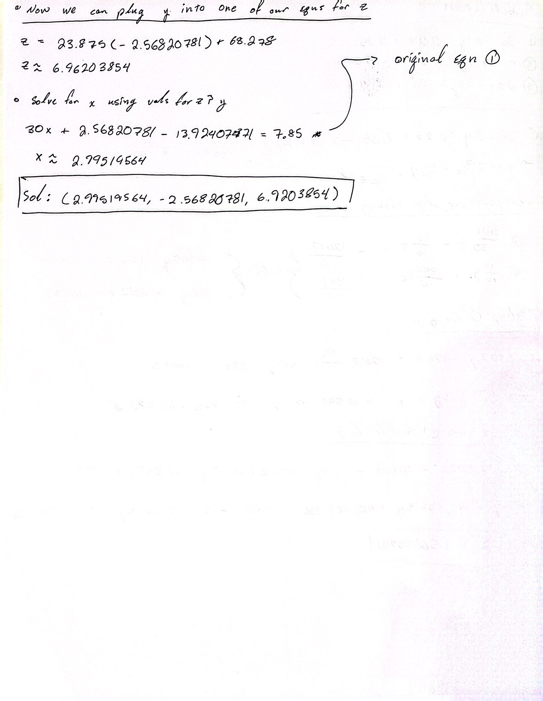
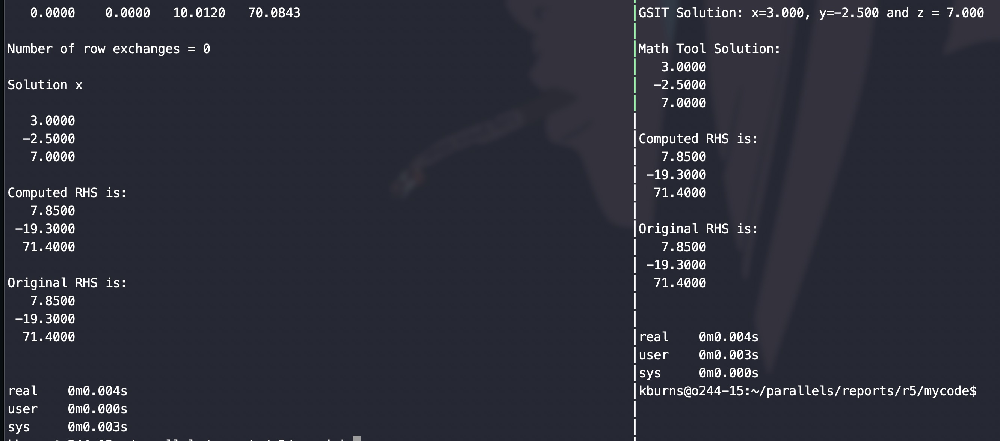
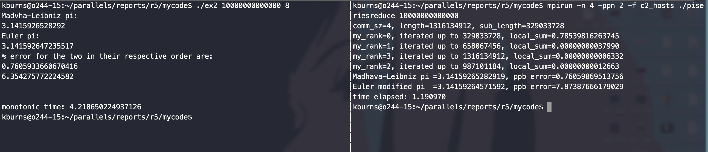
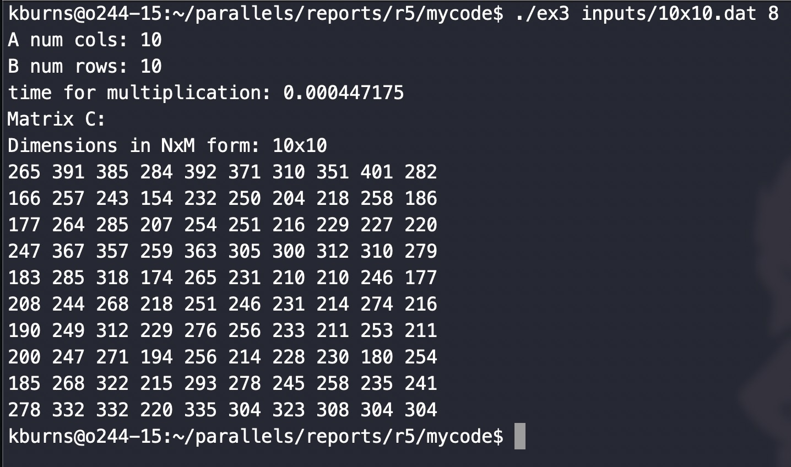
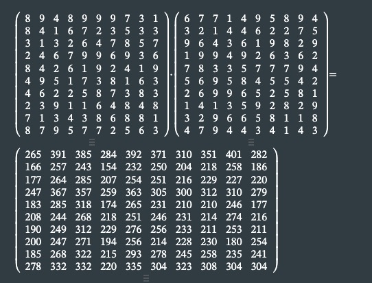
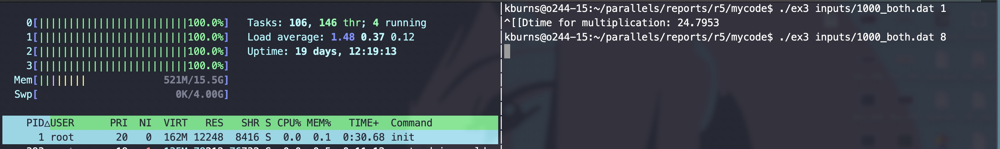
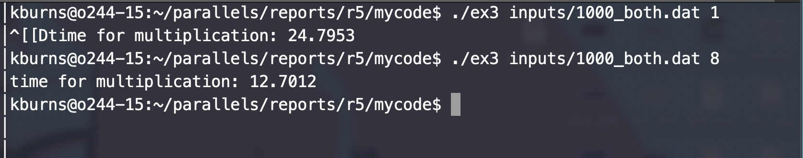

Keoni Burns  
CSCi 551

# Report 5

## Q1

$$\boxed {\begin{split} {3x-0.1y-0.2z=7.85, \  0.1x7y-0.3z = -19.3, \ 0.3x - 0.2y + 10z = 71.4} \end{split}}$$

- the system above is what we are asked to solve for using subsstitution and gaussian elimination


- this the verification for the solution using symbolab

### Simple Substitution




- above is the handwritten method for substitution
- as you can see in the there is a minor discrepency with the values however this is caused by rounding errors from the calculator being used as well as the numher of sigfigs being inconsistent towards the end of the problem

### Gaussian Elimination

### gewpp program vs gsit program



- as you can see from the above image both programs are essentially the same in terms of speed and accuracy
  - that being said i believe that in terms of readability gsit is much easier to understand as there aren't as many loops and indeces to keep track of

## Q2

### implementation

```cpp
using namespace std;
int main(int argc, char *argv[]) {
    struct timespec start, stop;
    double fstart, fstop;
    double first_sum = 0.0, sec_sum = 0.0;
    unsigned int length = 0;
    double constant = 1.0;
    unsigned int i = 0;
    int threads = 4;  // for default

    if (argc < 2) {
        cerr << "usage: ./ex2 <number of iterations, n> <number of threads>" << endl;
        exit(-1);
    } else {
        length = atoi(argv[1]);
    }
    if (argc == 3) {
        threads = atoi(argv[2]);
    }

    clock_gettime(CLOCK_MONOTONIC, &start);
    fstart = (double)start.tv_sec + ((double)start.tv_nsec / 1000000000.0);

#pragma omp parallel for num_threads(threads) reduction(+ : first_sum) reduction(+ : sec_sum) private(i) shared(length)
    for (i = 0; i < length; i++) {
        if (i % 2 == 0) {
            first_sum += constant / ((2.0 * (double)i) + 1.0);
        } else {
            first_sum += -constant / ((2.0 * (double)i) + 1.0);
        }
        sec_sum += 2.0 / (((4.0 * (double)i) + 1.0) * (4.0 * (double)i + 3.0));
    }

    clock_gettime(CLOCK_MONOTONIC, &stop);
    fstop = (double)stop.tv_sec + ((double)stop.tv_nsec / 1000000000.0);

    double Merr = 1000000000.0 * ((M_PI - (4.0 * first_sum)));
    double Eerr = 1000000000.0 * ((M_PI - (4.0 * sec_sum)));
    cout << setprecision(16);
    cout << "Madvha-Leibniz pi: \n" << (4 * first_sum) << endl;
    cout << "Euler pi: \n" << (4 * sec_sum) << endl;
    cout << "% error for the two in their respective order are:\n" << Merr << "\n" << Eerr << endl;
    cout << "\n\n"
         << "monotonic time: " << (fstop - fstart) << endl;
    return 0;
}
```

above is the code for the program

The logic is as follows:

- iterate from 0 to n

  - if divisible by 2 then the value of the series should be positive
  - this is the madvha-leibniz series which can be described by:
    $$
    \boxed{
        \Sigma ({2 \over n+1}),  where \ n \ is \ even
    }
    $$
    $$
    \boxed{
        \Sigma (-{2 \over n+1}),  where \ n \ is \ odd
    }
    $$
  - the second sum is the euler method which can be described by the series

  $$
  \boxed{
    \Sigma ({2 \over((4n+1)(4n+3))}), from \ 0 \ to \ n
  }
  $$

### OpenMP vs MPI



- from the values above we can discern two things
  1. the MPI program runs a whole lot faster than the openMp program
  2. there is an error difference of approximately 1.519600889565708 between the MPI and OpenMP implementations respectively

reasons for differences in speed may be:

- the openMP implementation may be inefficient, however, this is unlikely due to the simplicity of the program itself.
- it may be that the problem has not been scaled up enough to show openMP's speed up however this also seems unlikely

reasons for error difference:

- mpi uses summing between each of the ranks and so because of this it may have some errors when passing between each respective rank and the control rank, rank 0. OpenMp has shared memory however due to the directives passed in we can create a global var for each as a safeguard against overwriting and improper output

## Q3

### implementation

for this program i used a matrix struct to hold the dimensions as well as the actual 2 dimensional vector which holds our coefficients

```cpp
struct matrix_data {
    int n, m;  // dimensions of the matrix
    vector<vector<double>> matrix;
};
```

i also made a helper function to read in from a data file which parses through and assigns corresponding to their respective vars

```cpp
void read_input(matrix_data &A, matrix_data &B, string filename) {
    ifstream infile(filename, ios::in);
    if (!infile.is_open()) {
        cerr << "cannot open file: " << filename << endl;
        exit(-1);
    }

    /* grabbing the line that holds the NxM dimensions for A*/
    string line;
    if (!getline(infile, line)) {
        cerr << "can't grab first line" << endl;
    }

    istringstream aDims(line);  // delimit each of the strings on the line into a single word (aDims)
    if (!(aDims >> A.n >> A.m)) {
        cerr << "cant grab dims for A" << endl;
    }

    A.matrix.resize(A.n, vector<double>(A.m));  // resizing for given dimensions from .dat file

    /* grabbing the line that holds the NxM dimensions for B */
    if (!getline(infile, line)) {
        cerr << "can't grab second line" << endl;
    }

    istringstream bDims(line);
    if (!(bDims >> B.n >> B.m)) {
        cerr << "cant grab dims for B" << endl;
    }

    B.matrix.resize(B.n, vector<double>(B.m));

    // #pragma omp parallel for num_threads(threads)
    for (int i = 0; i < A.n; i++) {
        getline(infile, line);
        istringstream coefficients(line);
        for (int j = 0; j < A.m; j++) {
            coefficients >> A.matrix[i][j];
        }
    }

    // #pragma omp parallel for num_threads(threads)
    for (int i = 0; i < B.n; i++) {
        getline(infile, line);
        istringstream coefficients(line);
        for (int j = 0; j < B.m; j++) {
            coefficients >> B.matrix[i][j];
        }
    }
}
```

the implementation for the multiplication is a triple for loop, the outermost loop being the number of rows for the product matrix, the second inner accounting for the number of columns for our columns in the product matrix, and the innermost is so that we can iterate through each element of each row for the matrix A and B

** it should be noted that this works for varying dimensions for B so long as the number of columns for A is the same as the number of rows for B **

```cpp
void multiplication(matrix_data A, matrix_data B, matrix_data &C, int threads) {
    // the product's dimensions can be seen as the corresponding n & m from the matrices being multiplied
    C.n = A.n;
    C.m = B.m;
    C.matrix.resize(C.n, vector<double>(C.m));

#pragma omp parallel for num_threads(threads) collapse(3)
    for (int i = 0; i < A.n; i++) {
        for (int j = 0; j < B.m; j++) {
            for (int k = 0; k < A.m; k++) {
                C.matrix[i][j] += A.matrix[i][k] * B.matrix[k][j];
            }
        }
    }
}
```

the pragma includes a collapse directive as it turns the triple for loop into a singular space for the threads to evenly divide up the number of iterations

main():

```cpp
int main(int argc, char *argv[]) {
    // int total_itr = 0;
    string filename;
    matrix_data A;
    matrix_data B;
    matrix_data C;
    timespec start, end;
    int threads = THREADS;

    if (argc == 1) {
        cout << "enter num threads " << endl;
        cin >> threads;
        cout << "enter the dimensions for A in the format <n> <m>" << endl;
        cin >> A.n >> A.m;
        A.matrix.resize(A.n, vector<double>(A.m));

        cout << "enter one element at a time" << endl;
        for (int i = 0; i < A.n; i++) {
            for (int j = 0; j < A.m; j++) {
                cout << "element " << i << " " << j << ": ";
                cin >> A.matrix[i][j];
            }
        }

        cout << "enter the dimensions for A in the format <n> <m>" << endl;
        cin >> B.n >> B.m;

        if (A.m != B.n) {
            cerr << "the cols for A must be the same number as rows for B" << endl;
            exit(-1);
        }
        cout << "enter one element at a time" << endl;
        B.matrix.resize(B.n, vector<double>(B.m));
        for (int i = 0; i < B.n; i++) {
            for (int j = 0; j < B.m; j++) {
                cout << "element " << i << " " << j << ": ";
                cin >> B.matrix[i][j];
            }
        }
    } else {
        filename = argv[1];
        threads = atoi(argv[2]);
    }

    if (argc == 3) {
        read_input(A, B, filename);
    }

    cout << "A num cols: " << A.m << "\nB num rows: " << B.n << endl;
    if (A.m != B.n) {
        cerr << "this math isn't mathing.\nA must have the same number of columns as B does rows" << endl;
        exit(-1);
    }

    clock_gettime(CLOCK_MONOTONIC_RAW, &start);
    multiplication(A, B, C, threads);
    clock_gettime(CLOCK_MONOTONIC_RAW, &end);

    double time_taken;
    time_taken = (end.tv_sec - start.tv_sec) * 1e9;
    time_taken = (time_taken + (end.tv_nsec - start.tv_nsec)) * 1e-9;
    cout << "time for multiplication: " << time_taken << endl;

    // cout << "Matrix A: " << endl;
    // for (int i = 0; i < A.n; i++) {
    //     for (int j = 0; j < A.m; j++) {
    //         cout << A.matrix[i][j] << " ";
    //     }
    //     cout << endl;
    // }
    // cout << endl;

    // cout << "Matrix B: " << endl;
    // for (int i = 0; i < B.n; i++) {
    //     for (int j = 0; j < B.m; j++) {
    //         cout << B.matrix[i][j] << " ";
    //     }
    //     cout << endl;
    // }
    // cout << endl;

    cout << "Matrix C: " << endl;
    cout << "Dimensions in NxM form: " << C.n << "x" << C.m << endl;
    for (int i = 0; i < C.n; i++) {
        for (int j = 0; j < C.m; j++) {
            cout << C.matrix[i][j] << " ";
        }
        cout << endl;
    }

    return 0;
}
```

### Output correctness

here are the results for the program run on a 10x10 matrix, however it was tested against 100x100 matrix as well but the results were a bit unorganized so i chose not to include them



this has been verified with an online matrix calculator

link for calculator: https://matrixcalc.org/



### time analysis

here is the saturation for the program running at 8 threads



here is the time difference between the two run for a 1000x1000 matrix



our speed up is as follows:

$$\boxed{speed \ up = {24.7953s \over 12.7012s} \approx 1.9541} $$

given S = 2.19 we can find the amount of the program thats been parallelized using N = 8

$$\boxed{P = { N \times {1-(1 \div S) \over  (N-1)}} \ }$$

$$\boxed{P \approx 0.5565}$$

so about half of the program has been parallelized

### analysis

in this program I believe that more speed could be achieved by parallelizing the file i/o portion as it has a runtime of n^2 to read in all the values of the coefficients. that being said I didn't have enough time to figure out how to go about implementing this because it would require safeguarding from values being overwritten or being out of order

## Q4

### implementation

Main(): driver func

```cpp
int main(int argc, char *argv[]) {
    // int total_itr = 0;
    string filename;
    matrix_data A;
    int threads = THREADS;

    if (argc == 1) {
        cerr << "include the input file and number of threads please" << endl;
        exit(-1);
    } else {
        filename = argv[1];
        threads = atoi(argv[2]);
    }

    read_input(A, filename);

    cout << "A num rows: " << A.n << "\nA num cols: " << A.m << endl;

    cout << "Matrix A: " << endl;
    for (int i = 0; i < A.n; i++) {
        for (int j = 0; j < A.m; j++) {
            cout << A.matrix[i][j] << " ";
        }
        cout << endl;
    }
    cout << endl;

    gauss(A, threads);

    return 0;
}
```

readinput same helper function as in the previous exercise however i changed it to only take one matrix instead of 2

```cpp
void read_input(matrix_data &A, string filename) {
    ifstream infile(filename, ios::in);
    if (!infile.is_open()) {
        cerr << "cannot open file: " << filename << endl;
        exit(-1);
    }

    /* grabbing the line that holds the NxM dimensions for A*/
    string line;
    if (!getline(infile, line)) {
        cerr << "can't grab first line" << endl;
    }
    cout << line << endl;

    getline(infile, line);
    istringstream aDims(line);  // delimit each of the strings on the line into a single word (aDims)
    if (!(aDims >> A.n >> A.m)) {
        cerr << "cant grab dims for A" << endl;
    }

    A.matrix.resize(A.n, vector<double>(A.m));  // resizing for given dimensions from .dat file

    // #pragma omp parallel for num_threads(threads)
    for (int i = 0; i < A.n; i++) {
        getline(infile, line);
        istringstream coefficients(line);
        for (int j = 0; j < A.m; j++) {
            coefficients >> A.matrix[i][j];
        }
    }
}
```

gauss and helper functions:

```cpp
void gauss(matrix_data &A, int threads) {
    int flag;
    forwardStep(A, threads);
    if (flag != 0 && A.matrix[flag][A.m]) {
        cerr << "inconsistent system" << endl;
    } else if (flag != 0) {
        cout << "infinite solutions" << endl;
        return;
    }

    substitution(A, threads);
}

int forwardStep(matrix_data &A, int threads) {
    double maxVal;
    int maxPos;

    for (int k = 0; k < A.n; k++) {
        maxPos = k;                    // init current max
        maxVal = A.matrix[maxPos][k];  // grab value

#pragma omp parallel for num_threads(THREADS)
        for (int i = k + 1; i < A.n; i++) {  // search rows for the largest val and pivot
            if (abs(A.matrix[i][k]) > maxVal) {
                maxVal = A.matrix[i][k];
            }

            if (!A.matrix[k][maxPos]) {
                return k;
            }

            if (maxPos != k) {
                rowSwap(A, k, maxPos);
            }

            for (int i = k + 1; i < A.n; i++) {
                double reduce = A.matrix[i][k] / A.matrix[k][k];
                for (int j = k + 1; j <= A.n; j++) {
                    A.matrix[i][j] -= (A.matrix[k][j] * reduce);
                }
                A.matrix[i][k] = 0;
            }
        }
    }
    return 0;
}

void substitution(matrix_data &A, int threads) {
    vector<double> sol(A.n);

#pragma omp parallel for num_threads(threads)
    for (int i = A.n - 1; i >= 0; i--) {
        sol[i] = A.matrix[i][A.n];
        for (int j = i + 1; j < A.m; j++) {
            sol[i] -= A.matrix[i][j] * sol[j];
        }
        sol[i] = sol[i] / A.matrix[i][i];
    }
    cout << "solution is: " << endl;
    for (int i = 0; i < A.n; i++) {
        cout << sol[i] << endl;
    }
}
```
