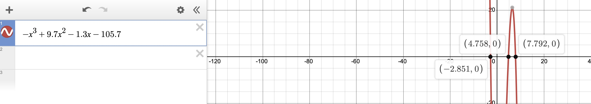
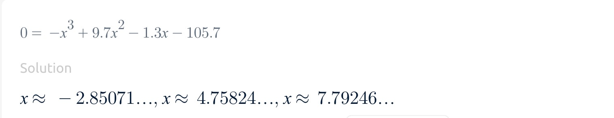
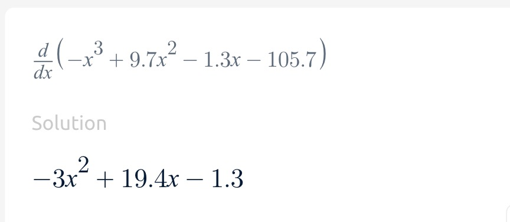
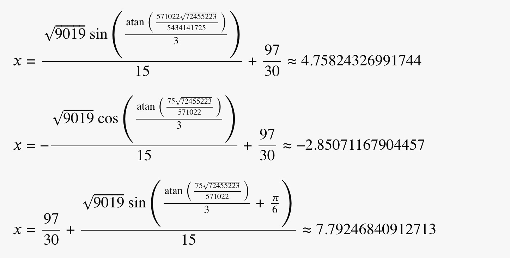

Keoni Burns  
CSCI 551

# Report 6

## Q1

### Desmos Graph & Roots









### Newton function logic

```cpp
double NewtRaph(double x0, double err, double n) {
    double root = 0, x1 = 0, h;
    if (fabs(derv(x0)) < err) {
        cout << "slope at " << x0 << " is " << derv(x0) << "\nit needs to be adjusted" << endl;

        x0 += err;
        for (int i = 0; i < n; i++) {
            if (fabs(derv(x0)) < err) {
                x0 += err;
            } else {
                break;
            }
        }

        cout << "new initial guess is " << x0 << endl;
    }

    if (fabs(derv(x0)) < err) {
        cout << "this aint the guess chief" << endl;
    }

    for (int i = 1; i <= n; i++) {
        h = func(x0) / derv(x0);
        x1 = x0 - h;
        if (fabs(func(x1)) < err) {
            printf("After %d iterations, root = %20.15lf\n", i, x1);
            return x1;
        }
        x0 = x1;
    }
    root = x0;
    return root;
}

```

the formula for the Newton-Raphson method is as follows:

$$\boxed {x_{n+1} = x_n - {f(x_n) \over f`(x_n)} }$$

using this formula and the starter code we can find a root given an initial guess. The function itself will iterate as many times as specified or until the root is found. Each iteration we reassign the initial guess to the value found by the formula. Additionally because this method is notorious for being bad if the initial value is too far off there are two checks that ensure we aren't dividing by 0 and that our initial guess isn't too far off.

### regula function

```cpp
double regula(int n, double x0, double x1, double x2, double x3, double err) {
    int itr = 0;
    regHelper(&x2, x0, x1, func(x0), func(x1), &itr);
    while (itr < n) {
        if (func(x0) * func(x2) < 0) {
            x1 = x2;
        } else {
            x0 = x2;
        }
        regHelper(&x3, x0, x1, func(x0), func(x1), &itr);
        if (fabs(x3 - x2) < err) {
            printf("After %d iterations, root = %20.15lf\n", itr, x3);
            return x3;
        }
        x2 = x3;
    }
    return 1;
}

void regHelper(double *x, double x0, double x1, double fx0, double fx1, int *itr) {
    *x = x0 - ((x1 - x0) / (fx1 - fx0)) * fx0;
    ++(*itr);
}
```

the regula formula is as follows:

$$\boxed {x=\frac{af(b)-bf(a)}{f(b)-f(a)}}$$

we use this formula to calculate the new value for our estimate. The algorithm works by calculating our initial x0 and x1 so we have our starting values and then we proceed to use the formula to find values for x2 and x3 checking if there has been convergence or a sign switch or not. if not we reassign our x values as there neighbor and continue until we find our root.

### regula output vs newton output


these are the results from both the newton and regula programs and from what we can see there are only a couple main differences:

- number of iterations
  - the regula method works better when the root is not very close and tends to need less iterations than its counterpart. Newton runs very well when the estimate is closer to the root and needs less in this circumstance
  - we can see that across all the different roots that newton method needs less iterations
- accuracy
  - across each of the roots for the function it can be seen that newtons method is much more accurate than the regula method as the verification function that plugs the root value found back into the function is much much much closer to true zero.
- speed
  - interestingly enough when the estimate is fairly close to the root Newton runs much faster than regula, but the opposite is also true. When the estimate is pretty far off the run time of newton is slower than regula.

## Q2


###

```

```
